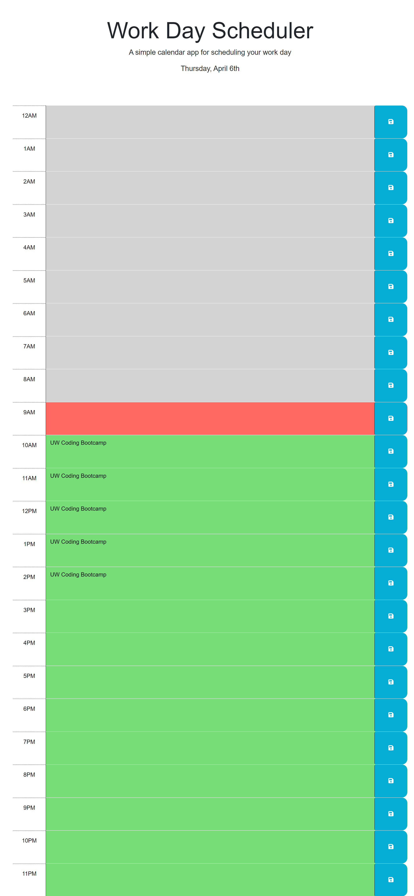

# Third-Party APIs: Work Day Scheduler

## Description

Create a simple calendar application that saves events for each hour of the day by modifying starter code. This app will run in the browser and feature dynamically updated HTML and CSS powered by jQuery.

I use the [Day.js](https://day.js.org/en/) library to work with date and time.

## User Story

```
AS AN employee with a busy schedule
I WANT to add important events to a daily planner
SO THAT I can manage my time effectively
```

## Acceptance Criteria

```
GIVEN I am using a daily planner to create a schedule
WHEN I open the planner
THEN the current day is displayed at the top of the calendar
WHEN I scroll down
THEN I am presented with timeblocks for standard business hours
WHEN I view the timeblocks for that day
THEN each timeblock is color coded to indicate whether it is in the past, present, or future
WHEN I click into a timeblock
THEN I can enter an event
WHEN I click the save button for that timeblock
THEN the text for that event is saved in local storage
WHEN I refresh the page
THEN the saved events persist
```
## Installation

N/A

## Usage

Schedule events for a day in a calendar.

### Deployed Site
https://fevercatdream.github.io/work-day-scheduler/

<br />

### Work Day Scheduler Screenshot


<br />

## Credits

Tutor: Doug Kumagai:
<br />
https://www.linkedin.com/in/doug-kumagai/
<br />
https://github.com/ndesmic


mdn web docs: https://developer.mozilla.org/en-US/

Day.js: https://day.js.org/en/

jQuery: https://jquery.com/


## License

Please refer to the LICENSE in the repo.